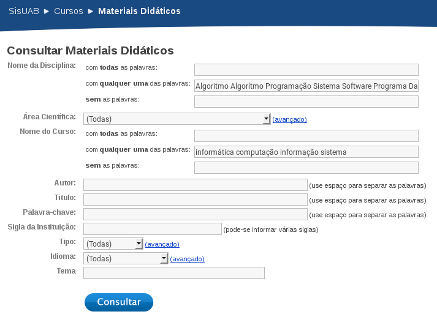
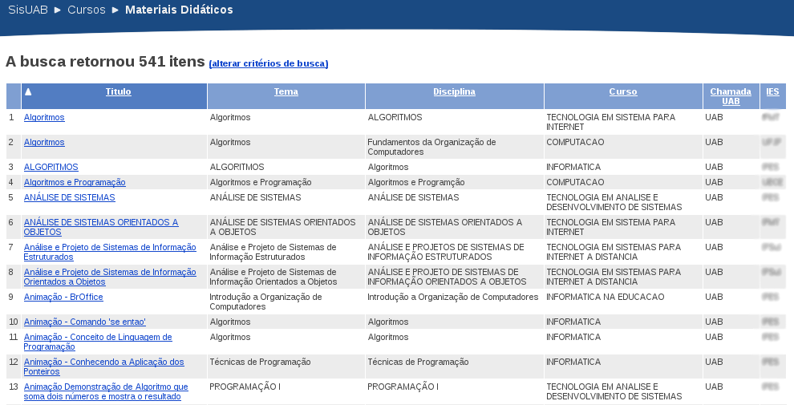

## Método

### Método de criação do corpus

De acordo com Yin (2015), o estudo de caso é utilizado para designar a análise de informação e a sua discussão em ciências sociais como a sociologia, a psicologia ou as ciências da educação. A pesquisa estudo de caso é uma das várias maneiras de realizar uma pesquisa nas ciências sociais, no nosso caso, optamos por este método por se tratar de um método qualitativo, capaz de nos dar informações para caracterizar o fenômeno da produção de materiais didáticos impressora para EAD.

Na primeira fase do projeto os integrantes continuarão conduzindo pesquisas bibliográficas sobre a produção e análise de materiais didáticos impresso para EAD.

Na segunda fase do projeto, cada integrante do grupo definirá o corpus de sua pesquisa, selecionando um subconjunto de livros que melhor represente a sua área de conhecimento pesquisada. Os corpora de livros analisados será divido em três corpus: os livros dos cursos de graduação a distância em Computação, História e Letras em Inglês, sob a responsabilidade de Eduardo, Paula e Camyle respectivamente. Por exemplo, livros que representam as áreas dos cursos de Computação, História e Letras em Inglês poderiam ser representados pelos materiais das disciplinas de “Introdução à Programação”, “Introdução aos Estudos Históricos” ou “Língua Inglesa: Práticas Discursivas do Cotidiano” respectivamente. Apesar dos cursos poderem possuírem livros de outras áreas, como disciplinas de Português Instrumental ou Matemática, esses livros não representam as áreas da pesquisa de cada integrante e, portanto, não serão adicionados ao corpus.1

Após a definição dos corpora, os integrantes do grupo elaborarão um método padronizada de análise, em relação às principais teorias de Design Instrucional para produção de materiais didáticos impresso para EAD. Ressaltamos que todos os integrantes da pesquisa utilizarão esta metodologia em suas pesquisas individuais.

Em seguida, a análise de cada corpus será realizada e os principais resultados serão apresentados e discutidos.

#### Consulta de Materiais Didáticos no Sisuab

A escolha dos materiais iniciou-se realizando uma Consulta de Materiais Didáticos no Sisuab com os seguintes critérios:


<!-- 

Disciplina: Algoritmo Algorítmo Programação Sistema Software Programa Dados Computação Informática Computador.

Contempla as seguintes disciplinas:

Algoritmo/Programação
Sistema/Sistema/Software
Banco de Dados
Computação/Informática/Computador


Curso: informática computação informação sistema

 --> 



A pesquisa retornou 541 itens. Em seguida, os resultados foram copiadados, página a página, e salvos em uma planilha, que manteve associado os links para baixar os livros desejados.




Para remoção dos resultados indesejados, faz-se necessário remover os resultados relacionados ao formato do material (vídeo, animação, *podcast*, etc.) e a área do livro. A remoção foi realizada através da exclusão de resultados que continham palavras que caracterizam um resultado indesejado: ``vídeo, video, tutorial, aula, saúde, saude, infográfico, educac, animação, podcast, ética, Instalaç e Bioinfo''. A exclusão foi realizada através do seguinte comando, que criou uma nova planilha com os resultados filtrados:


```bash
cat resultados-da-consulta-sisuab.csv | grep -v -i -e vídeo -e video -e tutorial \
-e aula -e saúde -e saude -e infográfico -e educac -e animação \
-e podcast -e ética -e Instalaç -e Bioinfo >  filtrados.csv 
```

Esse processo removeu 375 linhas, deixando a nova planilha com apenas 166 resultados. Para manter o cunho ético da pesquisa, as instituições de origem dos materiais foram ofuscadas.

O processo de ofuscação consistiu em ordenar os resultados pelo nome da instituição, e substituir o seu valor por uma letra. A planilha resultante desse processo encontra-se disponível em:

Essa planilha, após um
encontra-se disponível em , no entanto a coluna da instituição foi ofucada, para não expor as origens dos materiais. O processo de ofucação consistiu em ordenar 


Algoritmo Programação Sistema Software Programa Dados Computação Informática Computador


Algoritmos
Introdução a Organização de Computadores
Técnicas de Programação
Introdução a Organização de Computadores
Técnicas de Programação
Linguagem de Programação II
Algoritmos
Sistemas Operacionais 
INTRODUÇÃO À BIOINFORMÁTICA
Sistemas Multimídia
Banco de Dados
Engenharia de Software
Engenharia de Software
Introdução a Informática
Redes de Computadores
Sistemas Multimídia


2.2.3 :001 > [4,52,128,146,231,246,252,264,265,279,288,301].sample(2)
 => [52, 246] 
2.2.3 :002 > [136,143,147,148,149,150,312,313].sample(2)
 => [148, 313] 
2.2.3 :003 > [2,226,229,232,251,254,255].sample(2)
 => [255, 229] 
2.2.3 :004 > [3,45,134,135,154,157,158,161,162,165,170,171,172,173,174,175,180,181,186,187,191,192,209,212,222,223,234,248,257,268,269,270].sample(2)
 => [175, 171] 
2.2.3 :005 > [5,46,47,48,49,50,51,54,129,130,142,159,160,163,164,166,167,168,169,176,177,184,185,193,194,195,196,197,198,199,200,201,202,203,204,205,206,207,208,210,211,213,214,215,216,217,218,221,224,225,244,256,258,273,274,275,276,277,281,282,285,286,289,294,302,303,311].sample(2)
 => [166, 207] 
2.2.3 :006 > [1,6,44,144,230,233,260,291,295,300,314].sample(2)
 => [230, 260] 
2.2.3 :007 > [7,8,141,235,236,237,259,262,263,272,283,284,287,290,292,299,304,305,315,316].sample(2)
 => [283, 292] 
 
 
 
 
Erros: Arquivos corrompidos, arquivos indisponíveis, arquivos trocados, texto indicando local onde o recurso estaria disponível, conteúdo possuía apenas a capa, conteúdo não era texto.


## Referências

ABREU-FIALHO, Ana Paula; BARRETO, Cristine Costa. Design Instrucional versátil para materiais impressos – contemplando diversos perfis de aprendiz e aprendizagem. 2008. Disponível em: <http://www.nebad.uerj.br/publicacoes/artigos_em_anais_de_congressos/design_instrucional_%20versatil.pdf>. Acesso em: 5 nov. 2015.

EFFTING, Marilda Aparecida de Oliveira. Material didático impresso em EaD: Ferramenta que se estabelece. In: X Coloquio Internacional sobre Gestión Universitaria em América del Sur. Mar del Plata 8, 9 e 10 de dezembro de 2010. <http://repositorio.ufsc.br/xmlui/handle/123456789/96912> Acesso em: 10 nov. 2015

HORN, Vera. A linguagem do material didático impresso de cursos a distância. In: Revista da FAEEBA – Educação e Contemporaneidade, Salvador, v. 23, n. 42, p. 119-130, jul./dex. 2014 <www.revistas.uneb.br/index.php/faeeba/article/download/1032/712> Acesso em: 10 nov. 2015

PACHECO, Laíssa Rodrigues Esposti; COELHO, Cristiano Farias. O material didático impresso como facilitador na educação a distância. In: Simpósio Internacional de Educação a Distância. Encontro de Pesquisadores em Educação a Distância. Universidade Federal de São Carlos – UFSCar, 10 a 22 de setembro de 2012. <http://sistemas3.sead.ufscar.br/ojs/index.php/sied/article/view/220> Acesso em: 10 de nov. de 2015

RODRIGUES, Rosângela Schwarz; TAG, Vitor; VIEIRA, Eleonora Milano Falcão. Repositórios Educacionais: estudos preliminares para a Universidade Aberta do Brasil. Perspectivas em Ciência da Informação, v.16, n.3, p.181-207, jul./set. 2011. <http://portaldeperiodicos.eci.ufmg.br/index.php/pci/article/view/1249> Acesso em: 10 nov. 2015

SILVA, Andreza Regina Lopes da; CASTRO, Luciano Patrício Souza de. A relevância do design instrucional na elaboração de material didático impresso para cursos de graduação a distância. In: Revista Intersaberes, Curitiba, vol. 4, n. 8, p. 136-149, jul/dez 2009. <www.abed.org.br/.../04_a_relevancia_do_designer_instrucional_pt.pdf> Acesso: 10 nov. 2015

UAB. Plataforma SISUAB: Tutorial para compartilhamento de Material Didático. 2009. Disponível em: <http://sisuab.capes.gov.br/sisuab/RESOURCES/documentos/tutorialMaterialDidatico.pdf>. Acesso: 3 nov. 2015.

YIN, Robert. Estudo de Caso - Planejamento e Métodos. 5ª ed. Bookman Editora, 2015. Disponível em: <https://books.google.com.br/books?id=EtOyBQAAQBAJ&dq=estudo+de+caso&lr=&hl=pt-BR&source=gbs_navlinks_s>. Acesso em: 10 nov. 2015.

