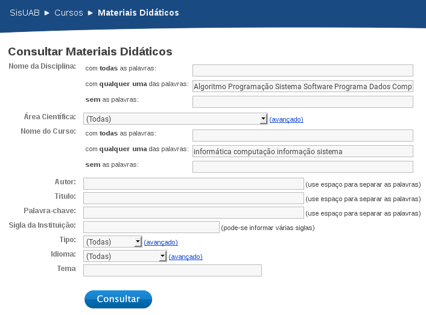
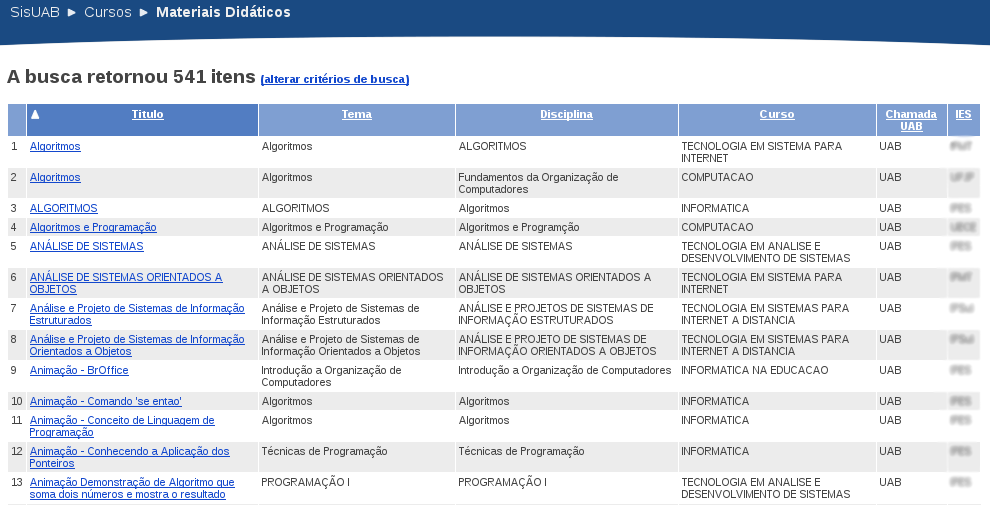

# Introdução

## Objetivo

### Objetivo geral

Analisar a implementação do Design Instrucional de materiais didáticos (impressos) para EAD em uma determinada área do conhecimento, através dos livros criados e depositados por diferentes IES (Instituições do Ensino Superior) no SisUAB.

### Objetivos específicos
- Investigar a implementação do Design Instrucional do material didático impresso para os cursos de licenciatura em Computação na modalidade a distância; (Eduardo de Santana Medeiros Alexandre)

## Justificativa

Nos últimos anos, a Educação a Distância deixou de ser apenas um espaço de ensino-aprendizagem e passou a ser o próprio objeto de pesquisa de diversas áreas que vão desde a Pedagogia passando pelas Ciências da Informação. Enquanto objeto de pesquisa, um dos pontos analisados na EAD é a produção de material impresso, a exemplo do seu Design instrucional. Este, de acordo com Abreu-Fialho e Barreto (2008), é uma nova estratégia para atribuir novos usos e sentidos a velhas tecnologias como é o caso do material didático impresso. Somado a isso, o design instrucional também interfere na aprendizagem do aluno, pois, o mesmo muitas vezes direciona a leitura do aluno, cria espaços de interação entre o aluno e o livro, construindo, assim, um espaço marcado pela hipertextualidade (SILVA; CASTRO, 2009).

Diante da importância do Design Instrucional na elaboração de material didático impresso, torna-se relevante realizar uma pesquisa que possa analisar os materiais didáticos impressos produzidos pelos cursos de graduação das áreas de Computação, História e Letras em Inglês. Uma vez que tal análise nos permitirá entender a elaboração dos livros, bem como perceber se em cada área citada há algum padrão no uso de Design Instrucional.

Na literatura encontramos diversos referenciais teóricos de como produzir materiais didáticos impressos para EAD e experiências de equipes de produção, mas não há estudos que apresentem como as técnicas de DI foram efetivamente implementadas nos livros de EAD no Brasil. 

Até mesmo as equipes que produziram os próprios materiais podem desconhecer a frequência com que as técnicas recursos foram utilizadas. Conhecer o padrão de utilização possibilita perceber quais técnicas foram subutilizadas, como também especular sobre a influência dos autores ou áreas no Design Instrucional das obras.

Esse trabalho representa uma contribuição empírica sobre a história do Design Instrucional no Brasil, ao analisar as obras do principal repositório de livros de educação a distância no Brasil. Os cursos de Computação, História e Letras em inglês foram escolhidos devido a serem as áreas de formação dos pesquisadores.

# Pressupostos teóricos

## Design Instrucional

O Design Instrucional (DI), pode ser entendido como um processo sistemático de planejamento e gerência de instrução para obter aprendizado efetivo [@Arinto2011]  [@aula2]. Existem diversos modelos para condução do processo de DI [@Scortegagna2011], sendo a etapa de produção dos materiais didáticos a mais relevante para essa pesquisa.

Durante essa etapa a equipe de produção dispõe de várias técnicas que podem ser implementadas, objetivando proporcionar o aprendizado efetivo dos alunos, através dos materiais didáticos. Algumas dessas técnicas serão apresentadas a seguir.

## Técnias de design instrucional

Nessa seção são apresentadas técnicas de Desgin Instrucional para produção de materiais didáticos impresso.

### Objetivos de Aprendizagem

Os objetivos de aprendizagem "estabelecem prioridades no conteúdo de uma aula e definem exatamente o que o aluno deverá ser capaz de executar ao final de seu estudo" [@aula2 p. 48]. O foco do objetivo está no que o aluno será capaz de realizar.

Recomenda-se que, além de claramente redigidas, essa técnica seja empregada no início das unidades didáticas [@Silva2013 p. 64]. Quando os objetivos são redigidos de forma mensurável é possível que os próprios alunos sejam capazes de verificar se atingiram os objetivos da unidade [@Wolfram97 p. 56].

O conceito de objetivo costuma ser confundido com o de *meta*, portanto faz-se necessário compreender sua distinção. A meta é "uma  descrição, em termos bastante gerais, do que o professor pretende fazer ao longo de uma aula (ou de um curso)" [@aula2 p. 46]. A meta é focada na emissão do professor, o que ele irá apresentar.

## Linguaguem dialógica

A utilização da técnica de linguagem dialógica possibilita diminuir dificuldades de compreensão do texto pelos alunos, proporcionando um sentimento de proximidade com o autor do texto, e a percepção de que existem pessoas preocupadas com o seu aprendizado [@aula2 p. 83-85]. Esse recurso é considerado essencial por alguns pesquisadores [@Silva2013 p. 65].

A utilização da linguagem dialógica nos materiais para educação a distância é um dos pontos de maior dificuldade dos professores do presencial que se propõem escrever para EAD [@aula2 p. 83].

## Atividades de autoavaliação

Nos materiais para EAD, as atividades de autoavaliação proporcionam oportunidades para os alunos consolidarem o seu processo de aprendizagem [@Silva2013 p. 66]. Recomanda-se utilizar atividades em vez de apresentações de princípios, generalizações e interpretações importantes [@aula2 p. 145], pois envolver os alunos com atividades escritas reduz-se as chances deles tornarem-se passivos e entediados durante o estudo [@Wolfram97 p. 80].


## Espaço para realização das atividades

Quando o material didático é diagramado com espaço para as respostas das atividades, os alunos apresentam-se mais propensos a respondê-las. Quanto menor o esforço mental para realizá-las maior será a proporção de alunos que irão respondê-las. Uma pesquisa indica que quando o espaço oferecido é de uma lacuna pequena, como questões de verdadeiro ou falso, mais de 80% dos alunos respondem, enquanto o espaço é maior, mesmo que a resposta seja curta, de menos de %50% dos alunos respondem [@aula2 p. 211].

## Ilustrações

Recomenda-se que a ilustrações inseridas nos materiais didáticos para EAD possuam uma função didática, e não apenas ilustrativa [@Preti2010 p. 113]. De forma geral, as ilustrações são melhor utilizadas nos seguintes contextos: a) algo é muito abstrato para ser explicada em palavras; b) algo é muito complexo para ser explicada em palavras; c) deseja-se que o aluno observe mais de uma ideia ao mesmo tempo [@Freeman2005 p. 111]. Além desses contextos, as ilustrações podem ser utilizadas buscando certos propósitos.

As ilustrações podem ser utilizadas com os seguintes propósitos: mostrar como algo parece, mostrar como algo funciona, apresentar relacionamentos quantitativos, exibir mudanças ao longo do tempo, apresentar relacionamentos ou padrões, apresentar estrutura, apresentar sequência ou processo, simplificar, motivar, causar emoção ou sentimento, dar ênfase, divertir ou decorar [@Freeman2005 p. 112].

## Referências a conteúdos multimídia

Para completar a leitura dos alunos, os materiais didáticos podem ofertar conteúdos multimídia através de links para sites, vídeos, animações, simulações, etc [@Silva2013 p. 66].

## Resumos

As seções de resumos, geralmente no final das unidades, tem o propósito de lembrar os alunos o que eles aprenderam [@Freeman2005 p. 82], destacar as ideias  centrais  do  texto  e  fazer  ligações  com  os  objetivos de aprendizagem estabelecidos [@Silva2013 p. 66].


## Informações periféricas sem quebrar fluxo

As informações periféricas são recursos que apresentam informações fora do fluxo central do texto (sem interferir na leitura sequencial), possibilitando os alunos trilharem camimhos diferentes de leituras, e favorencendo diferentes perfis de aprendizagem [@AbreuFialho2008].


As informações periféricas complementam o conteúdo pricipal do texto, costumam serem  utilizadas para aprofundar certos pontos da aula, apresentar curiosidades, apresentar informações a alunos menos preparado para o estudo daquela aula, ressaltar informações e conxtextualizar através de outras mídias [@Silva2013 p. 68]. 

## Lista de conteúdo por unidade

Esse recurso consiste em apresentar um minisumário por unidade de estudo, para que o aluno possa ver antecipadamente os conteúdos que serão abordados por ela, as vezes também apresenta-se através de uma lista de conceitos [@Freeman2005 p. 132].

## Glossário

O glossário tem o propósito de "facilitar a clareza e compreensão do texto, sem  que o aluno dependa de outra pessoa (professor, tutor, monitor) para  esclarecer o significado de algum termo mais preciso" [@Silva2013 p. 66], ou apenas para explicar o significado de palavras chaves [@Freeman2005 p. 133].

Recomenda-se que caso as explicações dos termos sejam breves, elas sejam apresentadas próximo a eles, caso contrário, podem ser colocadas no final do material ou unidade [@Preti2010 p. 106].

## Destaque do código

O destaque do código consiste em apresentar os códigos fonte com destaque (cor, negrito ou itálico) de acordo com a sintaxe da linguagem do código apresentada. Esse recurso, praticamente essencial em ambientes de programação, possibilita um aumento de 25% na legibilidade do código, tornando-o mais fácil de ser compreendido [@Sarkar2015].


# Método

## Perguntas da pesquisa

### Existenciais
- As técnicas foram utilizadas?

### Descritivas e de classificação
- Como as técnicas foram implementadas?
- Como podemos medi-las?
- Como podemos comparar a utilização das técnicas?

### Frequência
- Com que frequência as técnicas são normalmente utilizadas?

### Relacionamento
- Existe relação entre as disciplinas dos livros e as técnicas utilizadas?
- Existe relação entre as instituições e as técnicas utilizadas?

### Casualidade
- As disciplinas dos livros influenciam nas utilizações das técnicas?
- As instituições influenciam nas utilizações das técnicas?

### Análise Descritiva
- Como foram implementadas as técnicas de design instrucional nos livros de computação depositados no SisUAB?

### Análise Inferencial
- Existe diferença na implementação das técnicas de DI influenciadas pelo tipo da disciplina?
- Existe diferença na implementação das técnicas de DI no mesmo curso de uma instituição?
- Existe diferença na implementação das técnicas de DI numa mesma instituição?
- Como as técnicas de design instrucional variam numa mesma instituição?
- Como a implementação das técnicas de DI são influenciadas pelo tipo da disciplina?


## Definição do corpus da área de Computação

O corpus dos livros foi definido através de um processo sistemático de busca, para representar os livros produzidos para a área pesquisada:

- Definição de quais cursos representam a área e elaboração do seu *string* de busca.
- Definição de quais disciplinas representam a área pesquisa e elaboração do seu string de busca.
- Elaboração de critérios de exclusão e inclusão de livros.

O corpus de computação foi definido como sendo um subconjunto dos resultados de uma busca no SisUAB, que represente os materiais didáticos das disciplinas de computação, nos cursos de computação (*critério de inclusão*). Encontrar os parâmetros (*strings*) de busca que retorne os resultados desejados é um processo incremental, sendo refinados durante cada iteração de tentativa e avaliação.

A área de computação contempla vários cursos: Ciências da Computação, Informática, Sistemas de Informação, Tecnologia em Análise e Desenvolvimento de Sistemas. O *string* de busca do curso deve contemplar todos esses cursos.

O seguinte *string* final de busca foi elaborado para representar os cursos: “informática computação informação sistema”.

As disciplinas escolhidas para representar a área de computação foram: Linguagem de Programação, Introdução a Algoritmo, Sistemas Operacionais, Engenharia de Software, Redes de computadores, Estrutura de Dados, Banco de Dados e Arquitetura de Computadores.

O *string* final de busca elaborado para representar as disciplinas foi: “Algoritmo Programação Sistema Software Programa Dados Computação Informática Computador”. 



<!-- 

Curso: informática computação informação sistema
Disciplina: Algoritmo Algorítmo Programação Sistema Software Programa Dados Computação Informática Computador.

Contempla as seguintes disciplinas:

Algoritmo/Programação
Sistema/Sistema/Software
Banco de Dados
Computação/Informática/Computador

Algoritmo Programação Sistema Software Programa Dados Computação Informática Computador

DISCIPLINAS REAIS:
Algoritmos
Introdução a Organização de Computadores
Técnicas de Programação
Introdução a Organização de Computadores
Técnicas de Programação
Linguagem de Programação II
Algoritmos
Sistemas Operacionais 
INTRODUÇÃO À BIOINFORMÁTICA
Sistemas Multimídia
Banco de Dados
Engenharia de Software
Engenharia de Software
Introdução a Informática
Redes de Computadores
Sistemas Multimídia
--> 

### Removendo resultados indesejados

Essa consulta, realizada em Janeiro de 2015, retornou 541 resultados, sendo a maioria resultados indesejados, sendo necessário um processo para sua remoção.



Todos os resultados foram copiadados, página a página, e salvos em uma planilha (resultados-da-consulta-sisuab.csv), que manteve associado os links para baixar os respectivos livros.

A remoção dos resultados indesejados foi através da identificação de palavras que os indentificassem nas linhas da planilha. Para essa pesquisa, as seguintes palavras identificavam resultados indesejados: ``vídeo, video, tutorial, aula, saúde, saude, infográfico, educac, animação, podcast, ética, Instalaç e Bioinfo''. A exclusão foi realizada através do seguinte comando, que cria uma nova planilha com os resultados filtrados:

```bash
cat resultados-da-consulta-sisuab.csv | grep -v -i -e vídeo -e video -e tutorial \
-e aula -e saúde -e saude -e infográfico -e educac -e animação \
-e podcast -e ética -e Instalaç -e Bioinfo >  filtrados.csv 
```

Esse processo removeu 375 linhas, deixando a nova planilha ("filtrados.csv") com apenas 166 resultados. Para manter o cunho ético da pesquisa, as instituições e os cursos de origem dos materiais foram ofuscadas.

O processo de ofuscação consistiu em ordenar os resultados pelo nome da instituição e o curso, e substituir o seus valores por uma letra e um número respectivamente. Para possibilitar replicação da pesquisa, a planilha resultante desse processo foi nomeada "filtrados-e-ofuscados.csv" e encontra-se disponível em <http://dx.doi.org/10.5281/zenodo.47787>.

Os livros indisponíveis ou cadastrados errados foram removidos posteriormente. 

<!--  

Erros: Arquivos corrompidos, arquivos indisponíveis, arquivos trocados, texto indicando local onde o recurso estaria disponível, conteúdo possuía apenas a capa, conteúdo não era texto.

-->


### Removendo resultados indisponíveis, duplicados ou com erros

A remoção completa dos resultados indesejados só é possível após a verificação dos conteúdos dos arquivos. Portanto as próximas etapas foram iniciar os downloads dos arquivos e verificar os conteúdos.

Durante os downloads, verificou-se que 13 livros estavam indisponíveis e não puderam ser baixados. Para registrar essa situação uma nova coluna foi adicionada na planilha contendo a situação de disponibilidade de cada resultado.

Durante uma exploração dos arquivos baixados, foi verificado que existiam arquivos duplicados. Um script (*arquivos-duplicados.rb*) foi elaborado para identificar os arquivos duplicados. Uma nova coluna "Erro" foi adicionada à planilha, e 16 arquivos duplicados foram registrados. O script encontra-se disponível em <http://dx.doi.org/10.5281/zenodo.47800>.

As consistências dos demais arquivos foram verificadas e registradas na coluna "Erro", adicionada anteriormente. Os principais erros encontrados nos arquivos foram: não era um livro (animações, apenas capa, slides, lista de exercício ou vídeos), ou era de outra área, ou estava corrompido.

O último passo foi a remoção das versões duplicadas ou edições diferentes de um mesmo livro. Após uma exploração, foi verificado que alguns livros possuíam mais de uma edição, enquanto outros possuíam duas versões (uma para impressão e outra para distribuição na Internet). Para que cada livro contribua com apenas uma versão e uma edicação, foi decidido por excluir as edições mais novas e as versões para Web. Houveram casos que existiam versões diagramadas e não diargranadas (escritas no Word), nessas situações a versão diagramada era escolhida e a outra era descartada.

Esse processo de identificação de versões e edições é manual e demorado, para agilizá-lo a planilha foi ordenada por instituição e curso, e cada livro era comparado com os demais da mesma instituição.

No final do processo 95 resultados foram marcados como indisponíveis, com erro ou duplicado. O *corpus* dessa pesquisa foi definido como sendo os 71 livros restantes.


Ilustração
    Código não é ilustração
    Tela do software mostrando código sim.

## Piloto

Para elaborar e calibrar os instrumentos de coleta de dados e avaliação, uma piloto foi conduzido com dois livros de cada instituição selecionados, através de sorteios aleatórios, para serem analisados.

#### Como o piloto foi conduzido
    Seleção das amostras dos livros
    Elaboração do formulário
    Categorização dos livros em disciplinas
    Remoção de livros
        duplicados
        similares
            remove versão mais nova
                As vezes são lançados novos livros mudando apenas a capa, mantendo a mesma ficha técnina, inclusive com  o mesmo ISBN.
                160-005, quando os dois livros diferem no design, utilizar o mais recente (mais similar aos da instituição), pois pode denotar reutilização de material.

## Métrica e medição das implementações das técnicas


### Escala para avaliar as técnicas

Para facilitar a análise, foi determinado que o uso de todas as técnicas seriam avaliadas através de uma escala de 1 a 5:

1. O recurso não foi utilizado.
2. O recurso foi utilizado raramente, quase imperceptível.
3. A utilização do recurso foi perceptível, mas não o suficiente para ser percebido como uma prática parcialmente adotada na obra.
4. O recurso foi adotado parcialmente na obra. O recurso pode ter sido bem adotado em alguns capítulos, mas foi insuficiente para a obra inteira.
5. O recurso foi adotado e distribuído de forma suficiente por toda a obra.

Escala | Utilização         | Distribuição
:-----:| :----------------: | :-------------------------:
1      | Nunca              | 0% dos capítulos
2      | Raramente          | Até 20% dos capítulos
3      | Frequente          | De 20% a 50% dos capítulos
4      | Bastante frequênte | De 50% a 75% dos capítulos
5      | Bastante frequênte | De 75% a 100% dos capítulos

: Escala de avaliação segundo a utilização e distribuição da técnica.

#### Como as técnicas foram implementadas e como medi-las?
    Objetivos de Aprendizagem
        Implementação
            Sem objetivos
            Localização
                Objetivos por capítulo
                Objetivos por unidade
            Redação
                Textual
                Lista
                Verbos no infinitivo
            Bloom
        Medição
            1
                Localização/Frequencia
                    Texto(+0)
                    Unidade (+1)
                    Capítulo (+3)
                Redação
                    Textual(+0)
                    Listagem focando conteúdos(+1)
                    Bloom(+2)
        Validação da métrica
    Linguaguem dialógica
        Não foi utilizada
        Implementação
        Medição
            Linguagem
                Linguagem científica(0)
                Saudações(1)
                Monólogos(1)
                Mensagens motivacionais(1)
                Envolvimento do aprendente(3)
            Frequência
                1: O recurso não foi utilizado.
                2: O recurso foi utilizado raramente, quase imperceptível.
                3: A utilização do recurso foi perceptível, mas não o suficiente para ser percebido como uma prática parcialmente adotada na obra.
                4. O recurso foi adotado parcialmente na obra. O recurso pode ter sido bem adotado em alguns capítulos, mas foi insuficiente para a obra inteira.
                5. O recurso foi adotado distribuído de forma suficiente por toda a obra.
        Validação da métrica
    Atividades de autoavaliação
        Localização
            Início
            Fim do capítulo
        Quantidade
        Frequência
        Implementação
        Medição
    Espaço para realização das atividades
        Implementação
        Medição
    Respostas das Atividades de autoavaliação
        Implementação
        Medição
    Ilustrações Didáticas
        Implementação
        Medição
    Exemplos
        Implementação
        Medição
    Conteúdo Multimídia
        Implementação
        Medição
    Resumos
        Implementação
            Localização/Frequencia
                Não utilizado(1)
                Unidade (3)
                Capítulo (5)
        Medição
    Informações periféricas sem quebrar fluxo
        Implementação
        Medição
    Lista de conteúdo por unidade
        Implementação
        Medição
    Glossário
        Implementação
        Medição
    Destaque do código
        Implementação
        Medição
    Texto alinhado a esquerda
        Implementação
        Medição

#### Processo de aquisição dos dados
    Formulário de avaliação
    Validade

#### Análise dos dados
- Como foram implementadas as técnicas de design instrucional nos livros de computação depositados no SisUAB?


# Referências

ABREU-FIALHO, Ana Paula; BARRETO, Cristine Costa. Design Instrucional versátil para materiais impressos – contemplando diversos perfis de aprendiz e aprendizagem. 2008. Disponível em: <http://www.nebad.uerj.br/publicacoes/artigos_em_anais_de_congressos/design_instrucional_%20versatil.pdf>. Acesso em: 5 nov. 2015.

EFFTING, Marilda Aparecida de Oliveira. Material didático impresso em EaD: Ferramenta que se estabelece. In: X Coloquio Internacional sobre Gestión Universitaria em América del Sur. Mar del Plata 8, 9 e 10 de dezembro de 2010. <http://repositorio.ufsc.br/xmlui/handle/123456789/96912> Acesso em: 10 nov. 2015

HORN, Vera. A linguagem do material didático impresso de cursos a distância. In: Revista da FAEEBA – Educação e Contemporaneidade, Salvador, v. 23, n. 42, p. 119-130, jul./dex. 2014 <www.revistas.uneb.br/index.php/faeeba/article/download/1032/712> Acesso em: 10 nov. 2015

PACHECO, Laíssa Rodrigues Esposti; COELHO, Cristiano Farias. O material didático impresso como facilitador na educação a distância. In: Simpósio Internacional de Educação a Distância. Encontro de Pesquisadores em Educação a Distância. Universidade Federal de São Carlos – UFSCar, 10 a 22 de setembro de 2012. <http://sistemas3.sead.ufscar.br/ojs/index.php/sied/article/view/220> Acesso em: 10 de nov. de 2015

RODRIGUES, Rosângela Schwarz; TAG, Vitor; VIEIRA, Eleonora Milano Falcão. Repositórios Educacionais: estudos preliminares para a Universidade Aberta do Brasil. Perspectivas em Ciência da Informação, v.16, n.3, p.181-207, jul./set. 2011. <http://portaldeperiodicos.eci.ufmg.br/index.php/pci/article/view/1249> Acesso em: 10 nov. 2015

SILVA, Andreza Regina Lopes da; CASTRO, Luciano Patrício Souza de. A relevância do design instrucional na elaboração de material didático impresso para cursos de graduação a distância. In: Revista Intersaberes, Curitiba, vol. 4, n. 8, p. 136-149, jul/dez 2009. <www.abed.org.br/.../04_a_relevancia_do_designer_instrucional_pt.pdf> Acesso: 10 nov. 2015

UAB. Plataforma SISUAB: Tutorial para compartilhamento de Material Didático. 2009. Disponível em: <http://sisuab.capes.gov.br/sisuab/RESOURCES/documentos/tutorialMaterialDidatico.pdf>. Acesso: 3 nov. 2015.

YIN, Robert. Estudo de Caso - Planejamento e Métodos. 5ª ed. Bookman Editora, 2015. Disponível em: <https://books.google.com.br/books?id=EtOyBQAAQBAJ&dq=estudo+de+caso&lr=&hl=pt-BR&source=gbs_navlinks_s>. Acesso em: 10 nov. 2015.

