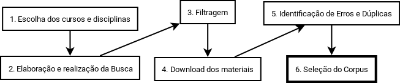

# Introdução

## Objetivo

### Objetivo geral

- Compreender como foi implementado o Design Instrucional de materiais didáticos da área de Computação na EAD no Brasil, através dos livros depositados por diferentes IES (Instituições do Ensino Superior) no SisUAB.

### Objetivos específicos

- Apresentar, explicar e sumarizar como as técnicas de Design Instrucional foram implementadas nos materiais didáticos específicos de Computação na EAD no Brasil.


## Justificativa

Nos últimos anos, a Educação a Distância deixou de ser apenas um espaço de ensino-aprendizagem e passou a ser o próprio objeto de pesquisa de diversas áreas que vão desde a Pedagogia passando pelas Ciências da Informação. Enquanto objeto de pesquisa, um dos pontos analisados na EAD é a produção de material impresso, a exemplo do seu Design instrucional. Este, de acordo com Abreu-Fialho e Barreto (2008), é uma nova estratégia para atribuir novos usos e sentidos a velhas tecnologias como é o caso do material didático impresso. Somado a isso, o design instrucional também interfere na aprendizagem do aluno, pois, o mesmo muitas vezes direciona a leitura do aluno, cria espaços de interação entre o aluno e o livro, construindo, assim, um espaço marcado pela hipertextualidade (SILVA; CASTRO, 2009).

Diante da importância do Design Instrucional na elaboração de material didático impresso, torna-se relevante realizar uma pesquisa que possa analisar os materiais didáticos impressos produzidos pelos cursos de graduação das áreas de Computação, História e Letras em Inglês. Uma vez que tal análise nos permitirá entender a elaboração dos livros, bem como perceber se em cada área citada há algum padrão no uso de Design Instrucional.

Na literatura encontramos diversos referenciais teóricos de como produzir materiais didáticos impressos para EAD e experiências de equipes de produção, mas não há estudos que apresentem como as técnicas de DI foram efetivamente implementadas nos livros de EAD no Brasil. 

Até mesmo as equipes que produziram os próprios materiais podem desconhecer a frequência com que as técnicas recursos foram utilizadas. Conhecer o padrão de utilização possibilita perceber quais técnicas foram subutilizadas, como também especular sobre a influência dos autores ou áreas no Design Instrucional das obras.

Esse trabalho representa uma contribuição empírica sobre a história do Design Instrucional no Brasil, ao analisar as obras do principal repositório de livros de educação a distância no Brasil. Os cursos de Computação, História e Letras em inglês foram escolhidos devido a serem as áreas de formação dos pesquisadores.

# Pressupostos teóricos

## Design Instrucional

O Design Instrucional (DI), pode ser entendido como um processo sistemático de planejamento e gerência de instrução para obter aprendizado efetivo [@Arinto2011]  [@aula2]. Existem diversos modelos para condução do processo de DI [@Scortegagna2011], sendo a etapa de produção dos materiais didáticos a mais relevante para essa pesquisa.

Durante essa etapa a equipe de produção dispõe de várias técnicas que podem ser implementadas, objetivando proporcionar o aprendizado efetivo dos alunos, através dos materiais didáticos. Algumas dessas técnicas serão apresentadas a seguir.

## Técnias de design instrucional

Nessa seção são apresentadas técnicas de Desgin Instrucional para produção de materiais didáticos impresso.

### Objetivos de Aprendizagem

Os objetivos de aprendizagem "estabelecem prioridades no conteúdo de uma aula e definem exatamente o que o aluno deverá ser capaz de executar ao final de seu estudo" [@aula2 p. 48]. O foco do objetivo está no que o aluno será capaz de realizar.

Recomenda-se que, além de claramente redigidas, essa técnica seja empregada no início dos capítulos (ou aulas) [@Silva2013 p. 64]. Quando os objetivos são redigidos de forma mensurável é possível que os próprios alunos sejam capazes de verificar se atingiram os objetivos da aula [@Wolfram97 p. 56].

O conceito de objetivo costuma ser confundido com o de *meta*, portanto faz-se necessário compreender sua distinção. A meta é "uma  descrição, em termos bastante gerais, do que o professor pretende fazer ao longo de uma aula (ou de um curso)" [@aula2 p. 46]. A meta é focada na emissão do professor, o que ele irá apresentar.

### Linguaguem dialógica

A utilização da técnica de linguagem dialógica possibilita diminuir dificuldades de compreensão do texto pelos alunos, proporcionando um sentimento de proximidade com o autor do texto, e a percepção de que existem pessoas preocupadas com o seu aprendizado [@aula2 p. 83-85]. Esse recurso é considerado essencial por alguns pesquisadores [@Silva2013 p. 65].

A utilização da linguagem dialógica nos materiais para educação a distância é um dos pontos de maior dificuldade dos professores do presencial que se propõem escrever para EAD [@aula2 p. 83] e por vezes acabam utilizando uma linguagem científica nos textos.

O diálogo nos materiais didáticos podem ser utilizados para estimular o aprendizagem baseado em conhecimentos prévios, motivar reflexões sobre o conteúdo, persuadir o aluno a continuar estudando os conteúdos, envolver o aluno oferecendo-o navegações para avançar ou retrocer no texto e convidar o aluno a reflexões compartilhadas através de perguntas retóricas [@Ivanda2011]. 


### Atividades de autoavaliação

Nos materiais para EAD, as atividades de autoavaliação proporcionam oportunidades para os alunos consolidarem o seu processo de aprendizagem [@Silva2013 p. 66]. Recomanda-se utilizar atividades em vez de apresentações de princípios, generalizações e interpretações importantes [@aula2 p. 145], pois envolver os alunos com atividades escritas reduz-se as chances deles tornarem-se passivos e entediados durante o estudo [@Wolfram97 p. 80].


### Espaço para realização das atividades

Quando o material didático é diagramado com espaço para as respostas das atividades, os alunos apresentam-se mais propensos a respondê-las. Quanto menor o esforço mental para realizá-las maior será a proporção de alunos que irão respondê-las. Uma pesquisa indica que quando o espaço oferecido é de uma lacuna pequena, como questões de verdadeiro ou falso, mais de 80% dos alunos respondem, enquanto o espaço é maior, mesmo que a resposta seja curta, de menos de %50% dos alunos respondem [@aula2 p. 211].

### Ilustrações

Recomenda-se que a ilustrações inseridas nos materiais didáticos para EAD possuam uma função didática, e não apenas ilustrativa [@Preti2010 p. 113]. De forma geral, as ilustrações são melhor utilizadas nos seguintes contextos: a) algo é muito abstrato para ser explicada em palavras; b) algo é muito complexo para ser explicada em palavras; c) deseja-se que o aluno observe mais de uma ideia ao mesmo tempo [@Freeman2005 p. 111]. Além desses contextos, as ilustrações podem ser utilizadas buscando certos propósitos.

As ilustrações podem ser utilizadas com os seguintes propósitos: mostrar como algo parece, mostrar como algo funciona, apresentar relacionamentos quantitativos, exibir mudanças ao longo do tempo, apresentar relacionamentos ou padrões, apresentar estrutura, apresentar sequência ou processo, simplificar, motivar, causar emoção ou sentimento, dar ênfase, divertir ou decorar [@Freeman2005 p. 112].

### Referências a conteúdos multimídia

Para completar a leitura dos alunos, os materiais didáticos podem ofertar conteúdos multimídia através de links para sites, vídeos, animações, simulações, etc [@Silva2013 p. 66].

### Resumos

As seções de resumos, geralmente no final dos capítulos, tem o propósito de lembrar os alunos o que eles aprenderam [@Freeman2005 p. 82], destacar as ideias  centrais  do  texto  e  fazer  ligações  com  os  objetivos de aprendizagem estabelecidos [@Silva2013 p. 66].


### Informações periféricas sem quebrar fluxo

As informações periféricas são recursos que apresentam informações fora do fluxo central do texto (sem interferir na leitura sequencial), possibilitando os alunos trilharem camimhos diferentes de leituras, e favorencendo diferentes perfis de aprendizagem [@AbreuFialho2008].


As informações periféricas complementam o conteúdo pricipal do texto, costumam serem  utilizadas para aprofundar certos pontos da aula, apresentar curiosidades, apresentar informações a alunos menos preparado para o estudo daquela aula, ressaltar informações e conxtextualizar através de outras mídias [@Silva2013 p. 68]. 

### Lista de conteúdo por unidade

Esse recurso consiste em apresentar um minisumário por unidade de estudo, para que o aluno possa ver antecipadamente os conteúdos que serão abordados por ela, as vezes também apresenta-se através de uma lista de conceitos [@Freeman2005 p. 132].

### Glossário

O glossário tem o propósito de "facilitar a clareza e compreensão do texto, sem  que o aluno dependa de outra pessoa (professor, tutor, monitor) para  esclarecer o significado de algum termo mais preciso" [@Silva2013 p. 66], ou apenas para explicar o significado de palavras chaves [@Freeman2005 p. 133].

Recomenda-se que caso as explicações dos termos sejam breves, elas sejam apresentadas próximo a eles, caso contrário, podem ser colocadas no final do material ou unidade [@Preti2010 p. 106].

### Destaque do código

O destaque do código consiste em apresentar os códigos fonte com destaque (cor, negrito ou itálico) de acordo com a sintaxe da linguagem do código apresentada. Esse recurso, praticamente essencial em ambientes de programação, possibilita um aumento de 25% na legibilidade do código, tornando-o mais fácil de ser compreendido [@Sarkar2015].


# Método


## Condução do Piloto

Para elaborar e calibrar todos os instrumentos da pesquisa um piloto foi conduzido inicialmente com um subconunto representativo dos livros escolhidos aleatoriamente.

Durante a execução do piloto foram identificados diversos problemas no repositório SisUAB: indisponibilidade de livros, arquivos corrompidos ou errados e livros duplicados. O corpus da pesquisa foi definido de forma sistemática, excluindo os livros que apresentavam algum problema.

A verificação da utilização das técnicas foram foi agilizada com a elaboração e utilização de um formulário, que sofreu diversas melhorias durante o processo. O formulário final será apresentado mais adiante.

A métrica e método de análise foram desenvolvidos durante o piloto para nortear a realização da pesquisa.

## Perguntas da pesquisa

### Existenciais
- As técnicas foram utilizadas?

### Descritivas e de classificação
- Como as técnicas foram implementadas?
- Como podemos medi-las?
- Como podemos comparar a utilização das técnicas?

### Frequência
- Com que frequência as técnicas são normalmente utilizadas?

### Relacionamento
- Existe relação entre as disciplinas dos livros e as técnicas utilizadas?
- Existe relação entre as instituições e as técnicas utilizadas?

### Casualidade
- As disciplinas dos livros influenciam nas utilizações das técnicas?
- As instituições influenciam nas utilizações das técnicas?

### Análise Descritiva
- Como foram implementadas as técnicas de design instrucional nos livros de computação depositados no SisUAB?

### Análise Inferencial
- Existe diferença na implementação das técnicas de DI influenciadas pelo tipo da disciplina?
- Existe diferença na implementação das técnicas de DI no mesmo curso de uma instituição?
- Existe diferença na implementação das técnicas de DI numa mesma instituição?
- Como as técnicas de design instrucional variam numa mesma instituição?
- Como a implementação das técnicas de DI são influenciadas pelo tipo da disciplina?

## O processo de definição do Corpus

O processo de definição do *corpus* da pesquisa conduzido de forma sistemática conforme apresentadas na imagem seguinte e explicadas posteriomente.



### Escolha dos cursos e disciplinas

A busca dos materias didáticos para análise está associada às disciplinas dos cursos ofertados pelas instituições vinculadas à UAB, e que tiveram seus materiais publicados no SisUAB. A busca por materiais didáticos no SisUAB permite retornar resultados por várias características, inclusive por curso e disciplina -- abordagem utilizada nessa pesquisa.

Para essa pesquisa desejava-se localizar livros específicos da área de computação, produzidos por cursos da mesma área. 
As disciplinas foram agrupadas por categorias -- para faciliar análise e seleção do *corpus* -- e apresentadas na tabela a seguir:

Categoria           | Disciplinas contempladas
:------------------:| :-------------------------------------------------------------------------------------------------
Programação         | Contempla as disciplinas de programação e algoritmos.
Sistemas            | Contempla diversas disciplinas como engenharia de software, análise de sistemas, sistemas operacionais etc.
Banco de Dados      | Contempla as disciplinas de banco de dados. 
Redes               | Contempla as disciplinas de redes. 
Arquitetura         | Contempla as disciplinas de arquitetura de computadores ou introdução a computação.
Estrutura de Dados  | Contempla as disciplinas de estrutura de dados, pesquisa e ordenação de dados ou complexidade de algoritmos.

A seleção exata de quais cursos e discipinas serão contempladas depende do resultado da busca e sua disponibilidade.

<!-- 

Curso: informática computação informação sistema
Disciplina: Algoritmo Algorítmo Programação Sistema Software Programa Dados Computação Informática Computador.

Contempla as seguintes disciplinas:

Algoritmo/Programação
Sistema/Sistema/Software
Banco de Dados
Computação/Informática/Computador

Algoritmo Programação Sistema Software Programa Dados Computação Informática Computador

DISCIPLINAS REAIS:
Algoritmos
Introdução a Organização de Computadores
Técnicas de Programação
Introdução a Organização de Computadores
Técnicas de Programação
Linguagem de Programação II
Algoritmos
Sistemas Operacionais 
INTRODUÇÃO À BIOINFORMÁTICA
Sistemas Multimídia
Banco de Dados
Engenharia de Software
Engenharia de Software
Introdução a Informática
Redes de Computadores
Sistemas Multimídia
--> 


### Elaboração e realização da busca

Pare realização de uma busca é necessário elaborar um *string* (ou parâmetros) de busca que irá retornar os resultados que se procura. Encontrar os parâmetros de busca que retorne os resultados desejados é um processo incremental, sendo refinados durante cada iteração de busca e avaliação.

A área de computação contempla vários cursos: Ciências da Computação, Informática, Sistemas de Informação, Tecnologia em Análise e Desenvolvimento de Sistemas, etc. O *string* de busca do curso deve contemplar todos esses cursos.

O seguinte *string* final de busca foi elaborado para representar os cursos: “informática computação informação sistema”. Percebe-se que todos os cursos listados contém pelo menos uma das palavras do *string* da busca, sendo portanto contemplado durante a busca.

As disciplinas escolhidas para representar a área de computação foram: Linguagem de Programação, Introdução a Algoritmo, Sistemas Operacionais, Análise de Sistemas, Engenharia de Software, Redes de computadores, Estrutura de Dados, Banco de Dados e Arquitetura de Computadores e Introdução a Computação.

O *string* final de busca elaborado para representar as disciplinas foi: “Algoritmo Programação Sistema Software Programa Dados Computação Informática Computador”. De forma similar, percebe-se que todas as disciplinas serão contempladas pelo parâmetro de busca.

A realização da busca consiste em utilizar os parâmetros de busca no SisUAB, conforme pode ser visto na imagem a seguir.


Essa consulta, realizada em Janeiro de 2015, retornou 541 resultados, sendo em sua maioria resultados irrelevantes que serão desconsiderados na etapa de *filtragrem*. Todos os resultados foram copiadados, página a página, e salvos em uma planilha, mantendo associados os links para baixar os respectivos livros. 


### Filtragem

A etapa de filtragem consiste em descartar os resultados irrelevantes. Nessa pesquisa ela foi realizada excluindo resultados que não aparentavam ser livros específicos de computação, os resultados dessa categoria incluíam vídeos, animações, conteúdos multidiciplinar etc.

Para essa pesquisa, as seguintes palavras identificavam os resultados irrelevantes: ``vídeo, video, tutorial, aula, saúde, saude, infográfico, educac, animação, podcast, ética, Instalaç e Bioinfo''. A exclusão dos resultados foi realizada através do seguinte comando no linux, que cria uma nova planilha com os resultados filtrados:

```bash
cat resultados-da-consulta-sisuab.csv | grep -v -i -e vídeo -e video -e tutorial \
-e aula -e saúde -e saude -e infográfico -e educac -e animação \
-e podcast -e ética -e Instalaç -e Bioinfo >  filtrados.csv 
```

Esse processo removeu 375 linhas (70%), deixando a nova planilha ("filtrados.csv") com apenas 166 resultados (30%). Para manter o cunho ético da pesquisa, as instituições e os cursos de origem dos materiais foram ofuscadas.


Resultados   | Quantidade | Percentual
:----------: | :---------:| :--------:
Total        | 541        | 100%
Irrelevantes | 375        | 70%
Filtrados    | 166        | 30%

O processo de ofuscação consistiu em ordenar os resultados pelo nome da instituição e o curso, e substituir o seus valores por uma letra e um número respectivamente. Para possibilitar replicação da pesquisa, a planilha resultante desse processo foi nomeada "filtrados-e-ofuscados.csv" e encontra-se disponível em <http://dx.doi.org/10.5281/zenodo.47787>.

Os livros indisponíveis ou cadastrados errados foram removidos em etapa posteriormente. 

<!--  

Erros: Arquivos corrompidos, arquivos indisponíveis, arquivos trocados, texto indicando local onde o recurso estaria disponível, conteúdo possuía apenas a capa, conteúdo não era texto.

-->

### Download do materiais

Durante a etapa de *download* de materiais todos os resultados filtrados foram baixados e renomeados com um pré-fixo correspondente a sua posição na planilha, para facilitar a identificação.

Verificou-se que 13 links para baixar os materias do SisUAB estavam indisponíveis impossibilitando o seu *download*. Para registrar essa situação uma nova coluna foi adicionada na planilha contendo a situação de disponibilidade de cada resultado.

A verificação do conteúdo dos arquivos foi realizada na próxima etapa.


### Identificação de erros e dúplicas

A remoção completa dos resultados indesejados só é possível após a verificação dos conteúdos dos arquivos, que ocorreu nessa etapa.

Durante uma exploração dos arquivos baixados, foi verificado que existiam arquivos duplicados. Um script (*arquivos-duplicados.rb*) foi elaborado para identificar os arquivos duplicados. Uma nova coluna "Erro" foi adicionada à planilha, e 16 arquivos duplicados foram registrados. O script encontra-se disponível em <http://dx.doi.org/10.5281/zenodo.47800>.

As consistências dos demais arquivos foram verificadas e registradas na coluna "Erro", adicionada anteriormente. Os principais erros encontrados nos arquivos foram: não era um livro (animações, apenas capa, slides, lista de exercício ou vídeos), ou era de outra área, ou estava corrompido.

O último passo foi a remoção das versões duplicadas ou edições diferentes de um mesmo livro. Após uma exploração, foi verificado que alguns livros possuíam mais de uma edição, enquanto outros possuíam duas versões (uma para impressão e outra para distribuição na Internet). Para que cada livro contribua com apenas uma versão e uma edicação, foi decidido por excluir as edições mais novas e as versões para Web. Houveram casos que existiam versões diagramadas e não diargranadas (escritas no Word), nessas situações a versão diagramada era escolhida e a outra era descartada.

Esse processo de identificação de versões e edições é manual e demorado, para agilizá-lo a planilha foi ordenada por instituição e curso, e cada livro era comparado com os demais da mesma instituição.

No final do processo 95 resultados foram marcados como indisponíveis, com erro ou duplicado. Os resultados restantes são válidos para serem selecionados como o *corpus*.

Resultados          | Quantidade | Percentual
:------------------:| :---------:| :--------:
Filtrados           | 166        | 100,00%
Indisponíveis       | 13         | 7,83%
Erro ou Duplicado   | 82         | 49,40%
Resultados restantes| 71         | 42,77%

A seleção exata de quais cursos e discipinas serão contempladas depende do resultado da busca.


### Seleção do corpus

Caso haja um número alto de resultados restantes o pesquisador pode optar por definir o corpus da pesquisa como sendo um subconjuto representativo dos resultados, como ocorreu nessa pesquisa.

Para escolha das materiais e análise posterior, os resultados foram categorizados na planilha de acordo com a disciplina do material. 

A seleção do corpus buscou adicionar, no mínimo, um livro de cada categoria de disciplina por curso, disponível nos resultados restantes. No entanto, os cursos não depositaram conteúdos relativos a todas as categorias no SisUAB.

Curso | Instituição | Quantidade
:----:|:-----------:| :---------:
A     | 1           | X
B     | 1           | X
C     | 1           | X
D     | 1           | X
E     | 1           | X

Categoria           | Quantidade
:------------------:| :---------:
Programação         | x
Sistemas            | x
Banco de Dados      | x
Redes               | x
Arquitetura         | x
Estrutura de Dados  | x


## Métrica e medição


Para facilitar a análise, foi utilizada uma escala ordinal para pontuar como as técnicas foram utilizadas. Para cada livro as técnicas serão pontuadas de 0 a 4, de acordo com a utilização da técnica e o quanto ela contemplada a obra:

Escala |  Contempla de forma suficiente
:-----:|  :-----------------------------:
0      |  A técnica não foi utilizada
1      |  Contempla até 25% da obra
2      |  Contempla de 26% a 50% da obra
3      |  Contempla de 51% a 75% da obra
4      |  Contempla de 76% a 100% da obra

: Escala de avaliação segundo a utilização e distribuição da técnica.

A escala de avaliação pode ser imaginada como sendo medidas de um quarto arredondadas para cima. Se a técnica não foi utilizada, será avaliada como 0. Se ela contemplou até 1/4 da obra, ela recebe a pontuação 1. Se contempou um pouco mais de 1/4, então recebe 2 até contemplar 2/4 e assim por diante.

Para exemplificar a métrica utilizada, suponhamos um livro com 5 capítulos e a utilização da técnica ``Ilustração'', as pontuações das utilizações da técnica poderiam ser realizadas da seguinte forma:


Pontuação | Situação
:--------:|------------------------------------------------------------
0         | O livro não possui ilustrações.
1         | O livro apresenta apenas um capítulo (20%) com ilustrações. 
2         | O livro possui dois capítulos (40%) bem ilustrados. Ou o livro possui 4 capítulos ilustrados, mas os dois deles possuem apenas uma única ilustração. Ou todos os capítulos possuem poucas ilustrações.
3         | O livro possui três capítulos (60%) bem ilustrados. Ou dois capítulos bem ilustrados e dois com poucas ilustrações.
4         | O livro possui quatro (80%) ou cinco (100%) capítulos bem ilustrados.


: Situações hipotéticas para avaliação da técnica Ilustração em um livro com 5 capítulos do mesmo tamanho.


A tabela a seguir foi elaborada para auxiliar a pontuação da utilização das técnicas com base na quantidade de capítulo e os percentuais das pontuações de 0 a 5 -- um avaliador por utilizá-la para determinar a avaliação de uma técnica. 

Capítulos | 0 |  1  (até 25%) | 2  (26% a 50%)|  3 (51% a 75%)|  4 (76% a 100%)
:--------:| :-:| :-:| :-:| :-:| :-:
4|0|1|2|3|4
5|0|1,25 |2,5|3,75|5
6|0|1,5|3|4,5|6
7|0|1,75| 3,5|5,25|7
8|0|2| 4|6|8
9|0|2,25|4,5|6,75|9
10|0|2,5|5|7,5|10
11|0|2,75|5,5|8,25|11
12|0|3|6|9|12
13|0|3,25|6,5|9,75|13
14|0|3,5|7|10,5|14
15|0|3,75|7,5|11,25|15
16|0|4|8|12|16

: Tabela de referência para auxiliar a pontuação das técnicas por quantidade de capítulos.


A noção de que a utilização de uma técnica *contempla um percentual da obra* é relativa a quantidade de páginas e a própria técnica utilizada. 

Daqui por diante o termo "utilização" será suprimido, e quando for mecionado ``avaliação da técnica'' estará se referindo a avaliação da utilização da técnica. A seguir são apresentadas considerações sobre as avaliações de cada técnica.


### Objetivos de Aprendizagem

A avaliação dos objetivos de aprendizagem apresenta as seguintes dificuldades: apresentação de metas no lugar de objetivos, o dimensionamento dos objetivos para o capítulo e objetivos apresentados por unidade (agrupamento de capítulos).

Caso hajam *metas* na lista dos objetivos elas devem ser desconsideradas. Nessa pesquisa, a métrica que busca medir a utilização de objetivos de aprendizagem contará apenas a utilização dos objetivos de aprendizagem, ignorando os objetivos escritos no formado de *meta*. De tal forma que, se em uma lista de objetivos de um capítulo houverem escritas apenas metas, então deve-se considerar que a técnica não foi utilizada nesse capítulo.

Deve existir uma proporcionalidade entre o número de objetivos e o tamanho do capítulo a que pertence. Considera-se que a técnica "Objetivos de Aprendizagem" contempla a obra inteira se os objetivos foram escritos por capítulo, em formato de lista e existe uma proporcionalidade suficiente entre os números de objetivos apresentados e a quantidade de páginas dos capítulos. Dificilmente um único objetivo de aprendizagem seria suficiente para contemplar apropriadamente um capítulo de 100 páginas, portanto durante a avaliação deve-se julgar se os objetivos válidos (que não são metas) são suficientes para contemplar a obra inteira.

A contabilidade dos objetivos apresentados por unidade será dividida pela quantidade de capítulos a que ela se refere. Alguns livros apresentam os objetivos por unidade, embora nesses casos os objetivos tenham sido dimensionados para contemplar diversos capítulos, na prática, o aluno sentirá dificuldades de verificar sua aprendizagem ao término de uma aula pois não há certezas sobre quais dos objetivos correspondem a cada aula. A avaliação nesse caso ocorrerá distribuindo os objetivos da unidade para os capítulos correspondentes e aplicando a noção proporciondalidade dos objetivos apresentada anteriormente.


### Linguaguem dialógica

A linguagem dialógica pode ser claramente percebida quando o texto produzido é centrado em um diálogo com o aluno. Os seguintes elementos são indícios da utilização de linguagem dialógica no texto: 

- Saudações
- Convite a reflexões e envolvimento
- Perguntas retóricas
- Ofertas de navegação no texto
- Frases motivacionais
- Presença da palavra "você"

A avaliação da linguagem dialógica deve levar em consideração como esses elementos foram utilizados e distribuídos pela obra.

### Atividades de autoavaliação

As atividades de autoavaliação quando presentes podem estarem distribuídas ao longo do texto ou condensadas nos finais dos capítulos, a ausência total de atividades também pode ser percebida em alguns materiais didáticos.

### Espaço para realização das atividades

A verificação de espaço para realização de atividades é relativamente fácil de ser realizada, basta procurar por linhas ou lacunas para o preenchimento. Atividades de marcar Verdadeiro (V) ou Falso (F) quase sempre proporcionam o espaço para seu preenchimento.

Os espaços deixados para anotações nos finais dos capítulos não deve ser confundido com o espaço para realizações de atividades. Alguns materiais deixam espaços para anotações nos final do capítulos e quando as atividades também estão condensadas no final pode-se imaginar que ele foi reservado para as realizadações das atividades, no entanto nesses casos percebe-se que os espaços não são convidativos para as respostas nem possuem o tamanho apropriado para as respostas, devendo portanto ser ignorados como espaços para realizações de atividades.


### Ilustrações Didáticas

As ilustrações serão consideradas didáticas somente quando estiverem referenciadas no texto e auxiliando a compreensão do conteúdo. Nessa categoria enquadram-se esquemas, ilustrações visuais dos conteúdos apresentados, *screenshots* de um processo, diagramas etc, que forem apresentados e contribuídos com a discussão ou aprendizado do texto.

As ilustrações meramente decorativas deverão ser ignoradas. Alguns materiais apresentam imagens decorativas, geralmente no início dos capítulos para compor o design da capa do capítulo, ou dispersas ao longo do texto sem nenhum texto relacionado a elas, essas imagens serão ignoradas pois trazem pouco valor didático.

Fotos de pessoas ou personagem também serão ignoradas quando o propósito for de apenas ilustrar a personalidade. Alguns textos apresentam fotografias de pessoas que estão sendo mencionadas, essas imagens não facilitam o entendimento do texto nem auxiliam no aprofundamento das discussões, sevem apenas para apresentar o personagem. Essas fotografias não serão consideradas ilustrações dialógicas, devendo ser ignoradas durante a avaliação.

As ilustrações serão contabilizadas por página. Ao avaliar a utilização das ilustrações, podemos contabilizar as páginas ilustradas e verificar sua abrangência para a obra, não sendo necessário contabilizar individualmente cada ilustração o que tornaria o processo custoso e não aumentaria a percepção de ilustração da obra.

### Referências a conteúdos multimídia

As referências a conteúdos multimídia costumam estarem destacados através 


###    Informações periféricas sem quebrar fluxo
        Implementação
        Medição

###    Resumos

###    Lista de conteúdo por unidade
        Implementação
        Medição
###    Glossário
        Implementação
        Medição
###    Destaque do código
        Implementação
        Medição
###    Texto alinhado a esquerda
        Implementação
        Medição

## Processo de aquisição dos dados


    Formulário de avaliação
    Validade

#### Análise dos dados
- Como foram implementadas as técnicas de design instrucional nos livros de computação depositados no SisUAB?


# Referências

ABREU-FIALHO, Ana Paula; BARRETO, Cristine Costa. Design Instrucional versátil para materiais impressos – contemplando diversos perfis de aprendiz e aprendizagem. 2008. Disponível em: <http://www.nebad.uerj.br/publicacoes/artigos_em_anais_de_congressos/design_instrucional_%20versatil.pdf>. Acesso em: 5 nov. 2015.

EFFTING, Marilda Aparecida de Oliveira. Material didático impresso em EaD: Ferramenta que se estabelece. In: X Coloquio Internacional sobre Gestión Universitaria em América del Sur. Mar del Plata 8, 9 e 10 de dezembro de 2010. <http://repositorio.ufsc.br/xmlui/handle/123456789/96912> Acesso em: 10 nov. 2015

HORN, Vera. A linguagem do material didático impresso de cursos a distância. In: Revista da FAEEBA – Educação e Contemporaneidade, Salvador, v. 23, n. 42, p. 119-130, jul./dex. 2014 <www.revistas.uneb.br/index.php/faeeba/article/download/1032/712> Acesso em: 10 nov. 2015

PACHECO, Laíssa Rodrigues Esposti; COELHO, Cristiano Farias. O material didático impresso como facilitador na educação a distância. In: Simpósio Internacional de Educação a Distância. Encontro de Pesquisadores em Educação a Distância. Universidade Federal de São Carlos – UFSCar, 10 a 22 de setembro de 2012. <http://sistemas3.sead.ufscar.br/ojs/index.php/sied/article/view/220> Acesso em: 10 de nov. de 2015

RODRIGUES, Rosângela Schwarz; TAG, Vitor; VIEIRA, Eleonora Milano Falcão. Repositórios Educacionais: estudos preliminares para a Universidade Aberta do Brasil. Perspectivas em Ciência da Informação, v.16, n.3, p.181-207, jul./set. 2011. <http://portaldeperiodicos.eci.ufmg.br/index.php/pci/article/view/1249> Acesso em: 10 nov. 2015

SILVA, Andreza Regina Lopes da; CASTRO, Luciano Patrício Souza de. A relevância do design instrucional na elaboração de material didático impresso para cursos de graduação a distância. In: Revista Intersaberes, Curitiba, vol. 4, n. 8, p. 136-149, jul/dez 2009. <www.abed.org.br/.../04_a_relevancia_do_designer_instrucional_pt.pdf> Acesso: 10 nov. 2015

UAB. Plataforma SISUAB: Tutorial para compartilhamento de Material Didático. 2009. Disponível em: <http://sisuab.capes.gov.br/sisuab/RESOURCES/documentos/tutorialMaterialDidatico.pdf>. Acesso: 3 nov. 2015.

YIN, Robert. Estudo de Caso - Planejamento e Métodos. 5ª ed. Bookman Editora, 2015. Disponível em: <https://books.google.com.br/books?id=EtOyBQAAQBAJ&dq=estudo+de+caso&lr=&hl=pt-BR&source=gbs_navlinks_s>. Acesso em: 10 nov. 2015.

